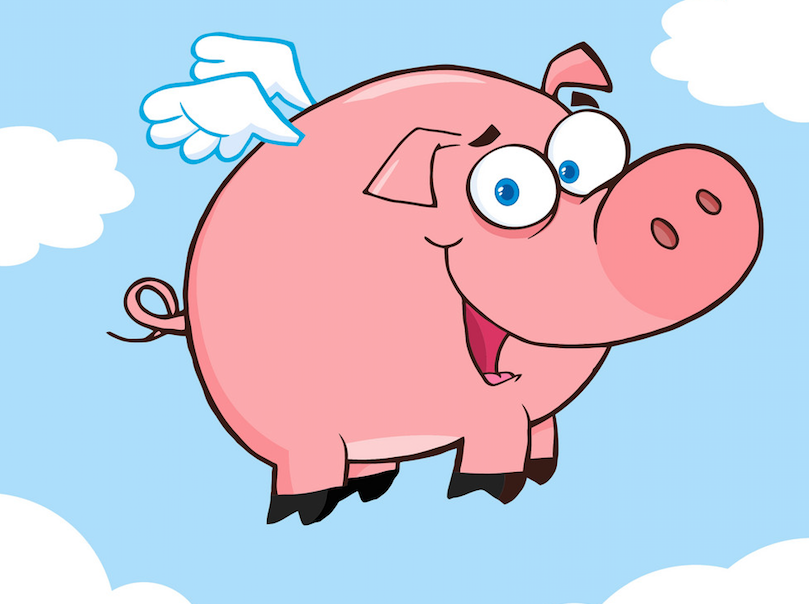
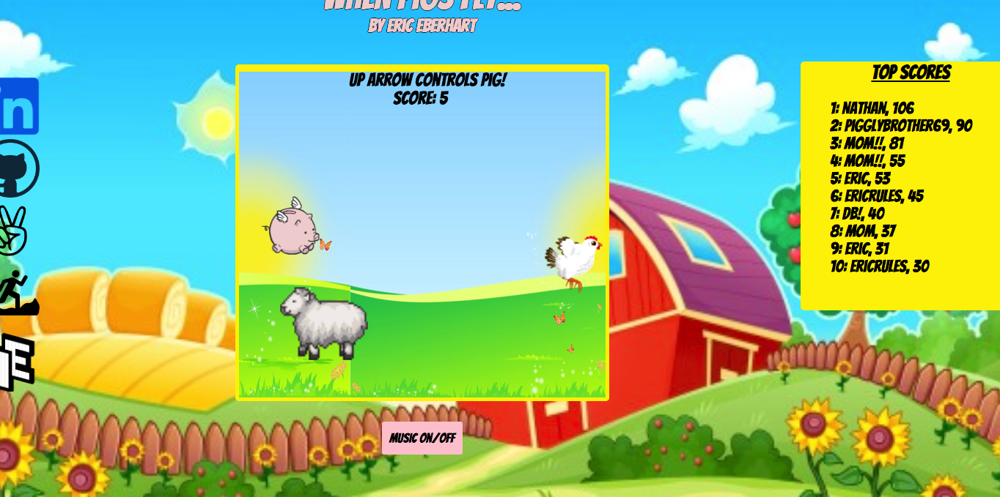
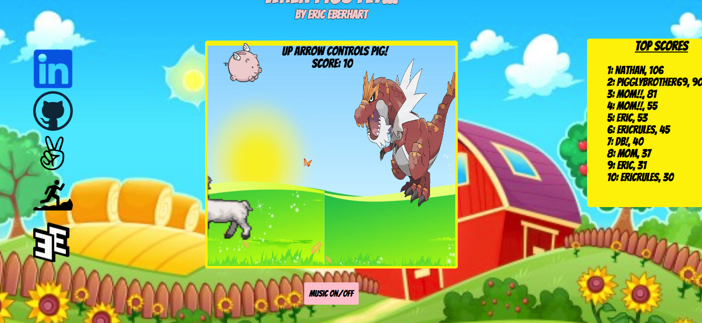
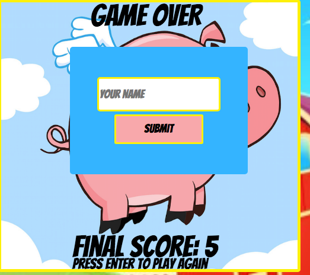
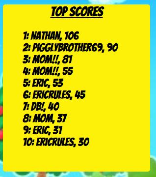
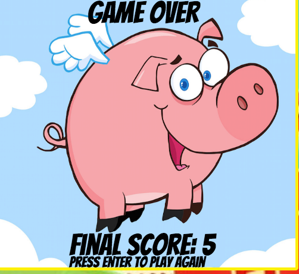
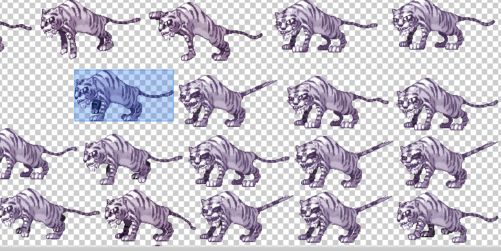

# When Pigs Fly

[Live Demo](https://eeberhart40.github.io/when-pigs-fly/)



## Features
* User control of character
* High Scores
* Animated background and characters
* Music

## Technologies Used
* **HTML5 Canvas** to animate characters and background
* **Vanilla JavaScript** to implement game logic
* **Google Firebase** to save and persist highscores

## Implementation
### Game play 
The game starts out with the pig character flying in the middle of the screen. Other animals begin to appear every second. With each new animal generated the user gains a point.



Pressing the `up` key causes the pig to ascend. Releasing the key causes the pig to float towards the bottom of the screen. The pig is bounded by the borders of the screen.



If the pig collides with another animal the game ends and a modal prompts the user to enter their name.



Upon submitting their score, the list of top scores updates and if the user has broken into the top 10 they will see their score.



The game over screen prompts the user to press enter/return to play again.




## Collision Logic
Every animal character is taken from sprite sheets with backgrounds that are invisible when drawn on a canvas. The animals are grabbed as rectangles with dimensions just large enough to fully encompass them. This means that the effective space each animal occupies in the game is that of the rectangle encompassing them, although they appear to take up less space when drawn on the game canvas.



In the game, collision occurs when the rectangle encompassing the pig bumps into or overlaps with that of another animal. To account for the extra space I allowed for "wiggle room" of 30%. 

```javascript
    collision() {
        const obstacles = this.obstacles.obstacleList;
        const pig = this.pig;

        obstacles.forEach(obstacle => {
            let pigSpace = {
                x: pig.posX,
                y: pig.posY,
                w: pig.width,
                h: pig.height
            };

            let obstacleSpace = {
                x: obstacle.spriteParams[4],
                y: obstacle.spriteParams[5],
                w: obstacle.spriteParams[6],
                h: obstacle.spriteParams[7]
            };
            
            //30% wiggle room
            let widthWiggle = Math.floor(obstacleSpace.w * 0.3)
            let heightWiggle = Math.floor(obstacleSpace.h * 0.3)

            if (pigSpace.x < obstacleSpace.x + obstacleSpace.w - widthWiggle &&
                pigSpace.x + pigSpace.w - widthWiggle > obstacleSpace.x &&
                pigSpace.y < obstacleSpace.y + obstacleSpace.h - heightWiggle &&
                pigSpace.y + pigSpace.h - heightWiggle > obstacleSpace.y) {
                this.gameOver = true;
            }
        });

    }
```

## Rendering High Scores
To save and persist scores I set up a "highScores" collection in a **Google Firebase** project. From there it was a simple matter of making use of pre-existing methods defined on the web API to post and fetch score entries.  I built a method to return the top ten scores ordered by descending score. 

```javascript
const fb = firebase.initializeApp(config);
const highScores = fb.firestore().collection("highScores");

export const postScore = (name, points) => {
    highScores.add({
        name,
        points
    });
};

export const fetchHighScores = () => {
    return highScores.orderBy("points", "desc").limit(10).get();
}
```
To render this list of scores I created a list element for each score entry and appended them to a pre-existing unordered list.

```javascript
    getScores(){
        fetchHighScores().then(scores => {
            scores.forEach(score => {
              this.topScores.push(score.data());
            });
        }).then(() => {
            this.renderTopScores();
        });

    }

    renderTopScores(){
     
        if(this.topScores.length === 0){
            this.scoreBoard.innerText = "NO HIGHSCORES YET";
        }

        this.topScores.forEach((entry, idx) => {
            let scoreLi = document.createElement('li');
            scoreLi.innerText = `${idx + 1}: ${entry.name}, ${entry.points}`;
            this.topScoresList.appendChild(scoreLi);

        })
    }

```
In order to ensure that a user would see the top scores list update if they broke into the top ten, I built a function to update the top scores upon submission of a new score. 

```javascript
    updateScores() {
        while (this.topScoresList.firstChild) {
            this.topScoresList.removeChild(this.topScoresList.firstChild);
        }

        this.getScores();
    }
```

## Planned Future Features
* Extra points for grabbing apples
* Boosting abilities for pig
* Pig shoots lasers to destroy obstacles!
